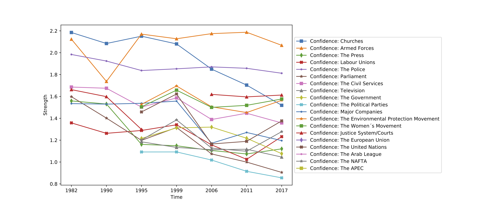
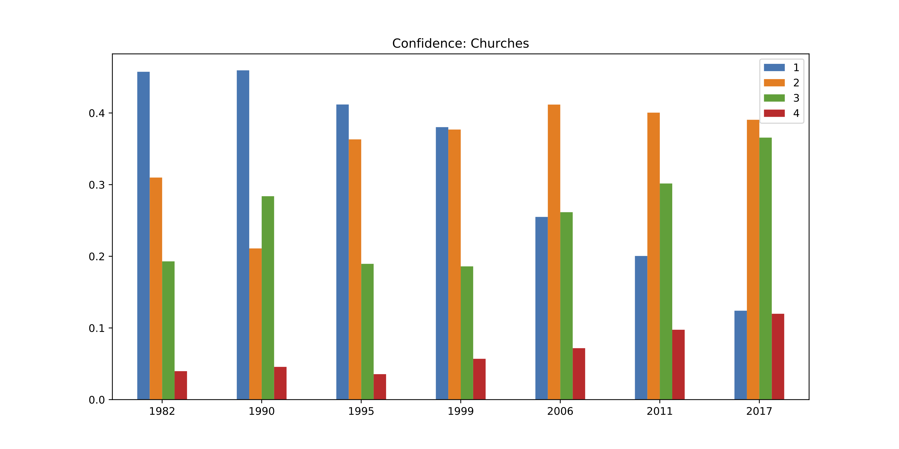

# World Value Survey Analysis
This is a simple analysis code for World Value Survey database (https://www.worldvaluessurvey.org).

## Usage
* `unzip us_time_series.csv.zip`
* `python3 process.py`

## Resulting Figures
* All the figures will be saved in `figs/series` or `figs/bar`

Currently the result include three kinds of questions:

#### Neighbors

    On this list are various groups of people. 
    Could you please mention any that you would not like to have as neighbors?
    
    0  Not mentioned
    
    1  Mentioned
    
    -1  Don´t know
    
    -2  No answer
    
    -4  Not asked

#### Confidence

    I am going to name a number of organizations. 
    For each one, could you tell me how much confidence you have in them: 
    is it a great deal of confidence, quite a lot of confidence, 
    not very much confidence or none at all?

    1  A great deal
    
    2  Quite a lot
    
    3  Not very much
    
    4  None at all
    
    -1  Don´t know
    
    -2  No answer
    
    -4  Not asked
    
    -5  Missing; Unknown

#### Importance in Life

        For each of the following aspects, indicate how important it is in your life. 
        Would you say it is very important, rather important, 
        not very important or not important at all
        
        1  Very important
        
        2  Rather important
        
        3  Not very important
        
        4  Not at all important
        
        -1  Don´t know
        
        -2  No answer
        
        -4  Not asked
        
        -5  Missing; Not available

## Example Result
#### Time Series Line Chart

#### Time Series Bar Chart
